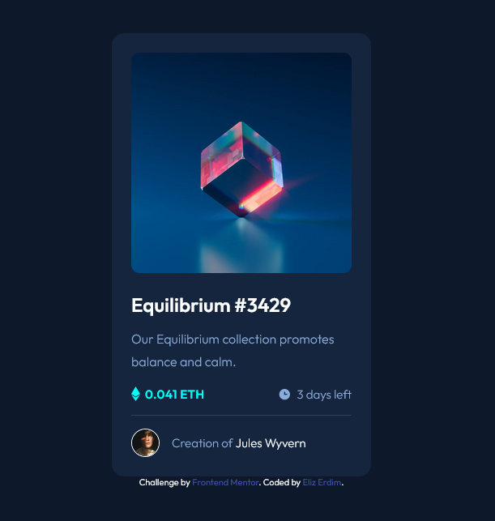

# Frontend Mentor - NFT preview card component solution

This is a solution to the [NFT preview card component challenge on Frontend Mentor](https://www.frontendmentor.io/challenges/nft-preview-card-component-SbdUL_w0U). 

## Table of contents

- [Overview](#overview)
  - [The challenge](#the-challenge)
  - [Screenshot](#screenshot)
  - [Links](#links)
- [My process](#my-process)
  - [Built with](#built-with)
  - [What I learned](#what-i-learned)
  - [Continued development](#continued-development)
  - [Useful resources](#useful-resources)

## Overview

### The challenge

Users should be able to:

- View the optimal layout depending on their device's screen size
- See hover and active states for interactive elements

### Screenshot



### Links

- [View Code](https://github.com/elizerdim/nft-preview-card-component)
- [Live Preview](https://elizerdim.github.io/nft-preview-card-component/)

## My process

### Built with

- Semantic HTML5 markup
- CSS custom properties
- Flexbox

### What I learned

The main challenge in this project was to figure out how to overlay the image with a transparent color and the eye icon for active and hover states. Combining active(or hover) pseudo-class and ::before pseudo-element did the trick. I also added a z-index of 999 to be on the safe side.

```css
.nft-card__image-link:active::before {
    content: url(./images/icon-view.svg);
    background-color: var(--cyan-transparent);
    border-radius: 10px;
    position: absolute;
    width: 100%;
    height: 100%;
    display: flex;
    justify-content: center;
    align-items: center;
    z-index: 999;
}
```

### Continued development

In future projects, I want to work on image overlays with animations, which I think will be more challenging.

### Useful resources

- [Image Overlay Examples](https://blog.logrocket.com/guide-image-overlays-css/)